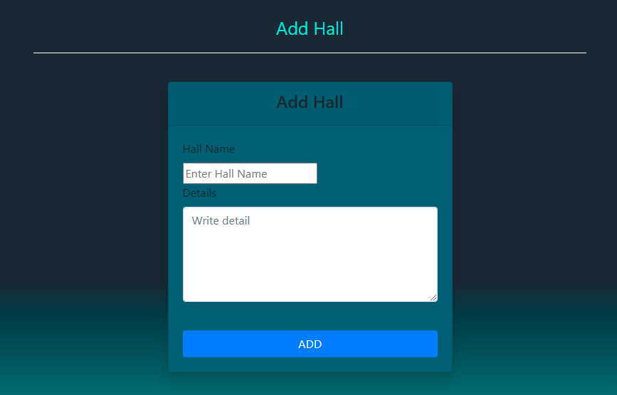

    HALL MANAGEMENT WEB

### Functionalities

1.Home page: First comes homepage

In homepage halls and details of halls will be shown. There is a homepage link inside image in topmost. Next to this several links such as home,login,apply for seat,notice and contact. After detail of halls in left corner two indicators that indicate male and female vacant seats in hall. At bottom copyright claim and link to administration interface is given.

2.Log In

This is resident login for students. To login a student needs to provide email and password.

3.Apply for a seat:

To be a resident of SUST halls a student first have to apply with those criteria shown in above image.

4.Notice:

Notices are shown here with the published date.

5.Contact:

Contacts of different halls with phone number and designation are shown here.

6.Interface after student login:

After logged in a student can complain and apply for leaving from hall. A credential of who is logged in is shown.

7.Complain:

A resident student can complain from here.

8.Apply for leaving hall:

Resident who wants to leave from hall can apply from this and need to confirm his/her email.

## Administration Interface

1.Home:

The above image shows how a admin interface looks like. An admin can modify database from here. Like add,delete,see result etc.

2.See Results:

Results like seat applicants,leaving applicants,complains,students identity links are attached here.

3. Customize Hall:

To customize hall

All other features are like those shown in the above.